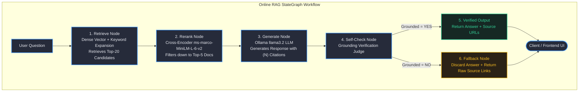
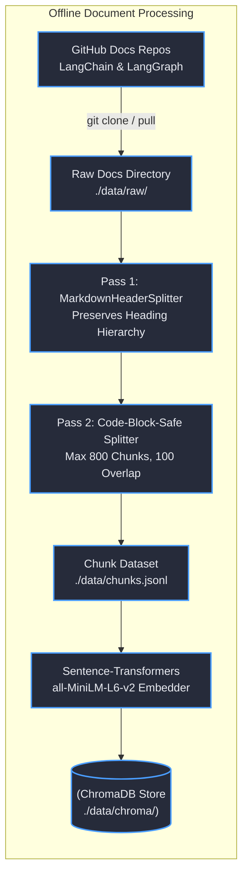
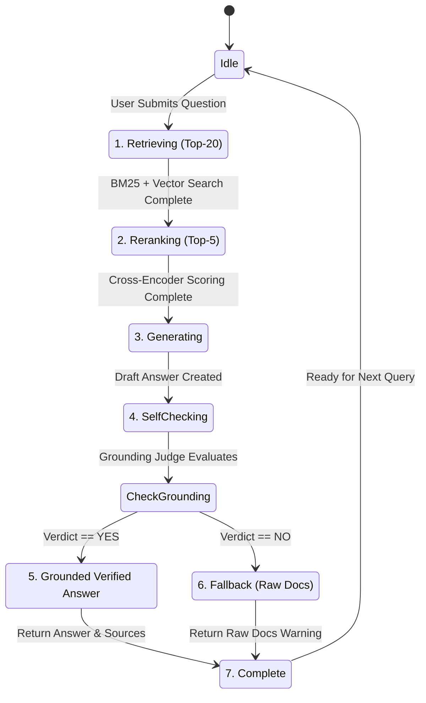
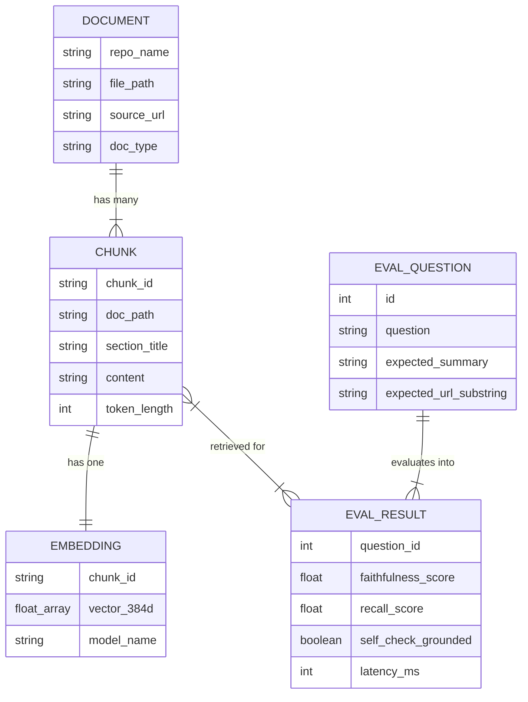
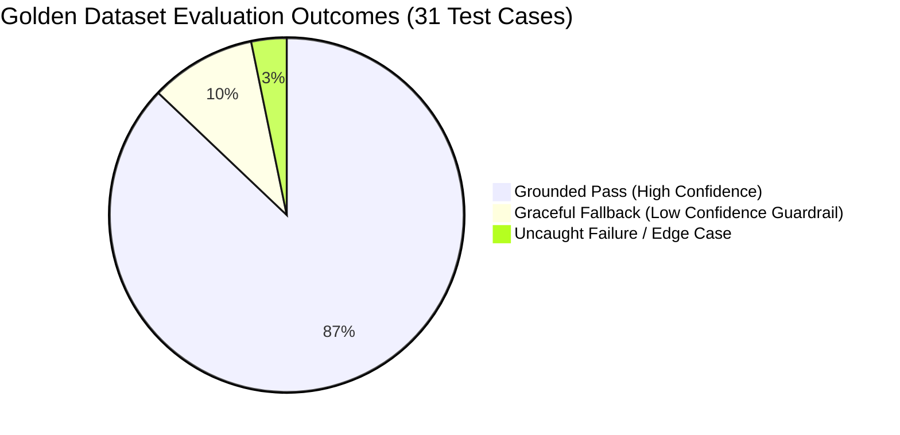
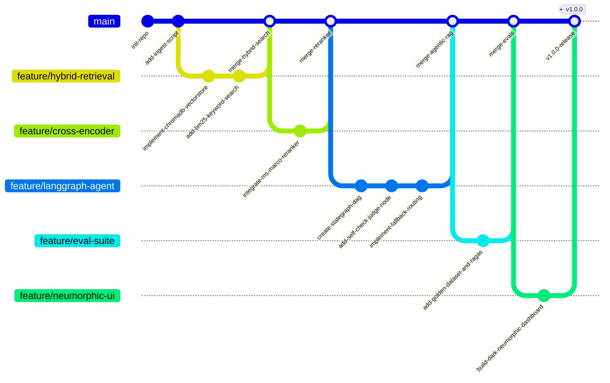
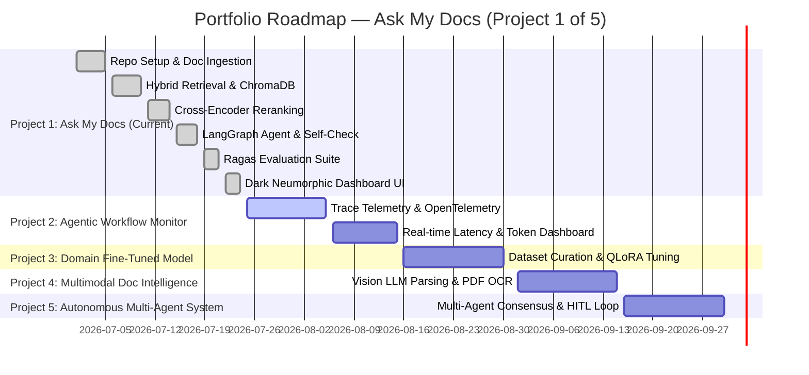

# Ask My Docs 🤖📚

> ⚙️ **Backend RAG pipeline repo:** [Ask-My-Docs](https://github.com/adarshthakur9240/Ask-My-Docs) — the LangGraph pipeline, retrieval, reranking, and eval suite this UI connects to.

> **Production-Grade LangGraph RAG Agent with Cross-Encoder Reranking & Self-Checking Grounding**

[](https://python.org)
[](https://python.langchain.com)
[](https://langchain-ai.github.io/langgraph)
[](https://nextjs.org)
[](https://fastapi.tiangolo.com)
[](https://ollama.ai)
[](LICENSE)
[](https://ollama.ai)

---

## 📑 Table of Contents

- [⚡ Executive Summary](#-executive-summary)
- [💡 Why This Matters (Production RAG Engineering)](#-why-this-matters-production-rag-engineering)
- [⚖️ Naive RAG vs. Ask My Docs](#️-naive-rag-vs-ask-my-docs)
- [📸 Demo](#-demo)
- [🏗️ System Architecture & Data Flow](#️-system-architecture--data-flow)
- [🔄 Request Lifecycle (Sequence Diagram)](#-request-lifecycle-sequence-diagram)
- [🔀 State Machine Graph (State Diagram)](#-state-machine-graph-state-diagram)
- [🗄️ Data Model & Schema (ER Diagram)](#️-data-model--schema-er-diagram)
- [🛠️ Tech Stack & Implementation Decisions](#️-tech-stack--implementation-decisions)
- [🎯 The "7 Signals" Engineering Design](#-the-7-signals-engineering-design)
- [📊 Evaluation Results & Metrics](#-evaluation-results--metrics)
- [🗺️ Portfolio Roadmap & Development Timeline](#️-portfolio-roadmap--development-timeline)
- [⚠️ Known Failure Modes & Engineering Trade-Offs](#️-known-failure-modes--engineering-trade-offs)
- [❓ Frequently Asked Questions (FAQ)](#-frequently-asked-questions-faq)
- [🚀 Getting Started & Setup Guide](#-getting-started--setup-guide)
- [📂 Project Structure](#-project-structure)
- [📄 License & Contact](#-license--contact)

---

## ⚡ Executive Summary

**Ask My Docs** is a zero-cost, privacy-focused RAG system built to answer complex questions over official **LangChain & LangGraph documentation**. 

Unlike standard naive RAG wrappers, it implements a **5-node LangGraph `StateGraph`** featuring **hybrid retrieval** (dense vector + keyword BM25 expansion), **local Cross-Encoder reranking** (`ms-marco-MiniLM-L-6-v2`), **Ollama local LLM generation** (`llama3.2`), and an **autonomous self-checking judge node**. If generated answers fail grounding checks, the agent gracefully routes to a safe fallback state returning raw doc citations rather than hallucinating.

---

## 💡 Why This Matters (Production RAG Engineering)

In applied AI engineering, **hallucination** and **rigorous evaluation** are the two hardest unsolved challenges facing enterprise RAG systems:
- **Naive vector search fails in production**: Standard cosine similarity often retrieves contextually irrelevant or outdated chunks when documentation structure changes.
- **LLMs default to confident guessing**: When missing relevant context, language models generate convincing, plausible-sounding hallucinated API methods.
- **Unmonitored RAG degrades over time**: Without automated golden dataset evaluations, prompt or chunking updates break retrieval accuracy silently.

**Ask My Docs** directly addresses these production realities by enforcing a **multi-stage precision pipeline** with automated self-checking guardrails, local zero-cost models, and comprehensive Ragas evaluation benchmarks.

---

## ⚖️ Naive RAG vs. Ask My Docs

| Engineering Feature | Naive RAG (Basic Tutorial) | Ask My Docs (Production Architecture) |
| :--- | :--- | :--- |
| **Retrieval Strategy** | Single-pass vector search ($K=3$) | **Hybrid Vector + Keyword BM25 Expansion** ($K=20$) |
| **Context Quality** | Raw vector distance ranking | **Cross-Encoder Reranking** (`ms-marco-MiniLM-L-6-v2`) |
| **Hallucination Control** | None — LLM outputs unverified draft | **Autonomous Self-Checking Judge Node** (`self_check_node`) |
| **Fallback Behavior** | Confidently outputs hallucinated syntax | **Graceful Fallback** — returns raw source docs when unconfident |
| **Offline Chunking** | Blind character splitting | **Markdown Header-Aware + Code-Block-Safe Splitter** |
| **Infrastructure Cost** | Cloud API fees per request | **100% Local & Free** (Ollama + Sentence-Transformers + ChromaDB) |
| **Evaluation Suite** | Manual ad-hoc spot checking | **Automated Ragas Benchmark Suite** (31 Golden Dataset Questions) |
| **User Experience** | Basic text box | **Dark Neumorphic Dashboard UI** with live state execution graph |

---

## 📸 Demo

> * Dashboard UI featuring real-time state graph visualization, inline citations, and latency tracking.*

```text
┌─────────────────────────────────────────────────────────────────────────────┐
│ 🤖 ASK MY DOCS — Dark Neumorphic EV Control Panel UI                        │
├─────────────────────────────────────────────────────────────────────────────┤
│ ┌─────────────────────────────────────────────────────────────────────────┐ │
│ │ 📊 Pipeline: [Retrieve: Top-20] ➔ [Rerank: Top-5] ➔ [Generate] ➔ [Check] │ │
│ └─────────────────────────────────────────────────────────────────────────┘ │
│                                                                             │
│ 👤 User: How do I add memory to a LangGraph agent?                         │
│                                                                             │
│ 🤖 Bot [Grounded ✓] [latency: 1,420 ms]:                                    │
│    To add short-term memory to a LangGraph agent, pass a MemorySaver         │
│    checkpointer when compiling the graph...                                 │
│                                                                             │
│    Sources: ↗ add-memory.md  ↗ checkpointers.md                             │
└─────────────────────────────────────────────────────────────────────────────┘
```

<!-- Placeholder for GIF/Screenshot: ./assets/demo.gif -->

---

## 🏗️ System Architecture & Data Flow

### 1. Online Query Pipeline (`graph.py`)

The query workflow is modeled as a stateful Directed Acyclic Graph (DAG) with conditional fallback routing:



### 2. Offline Data Ingestion Pipeline (`ingest.py` & `embed.py`)

The indexing pipeline clones target repositories, chunks markdown text without breaking code blocks, embeds vectors locally, and persists them into ChromaDB:



---

## 🔄 Request Lifecycle (Sequence Diagram)

This sequence diagram illustrates the complete request/response interaction across system boundaries:

```mermaid
sequenceDiagram
    autonumber
    actor User as User
    participant UI as Next.js UI
    participant API as FastAPI Server
    participant Graph as LangGraph Engine
    participant DB as ChromaDB
    participant LLM as Ollama (Llama3.2)

    User->>UI: Submit Question ("How do I add memory?")
    UI->>API: POST /api/ask {question}
    API->>Graph: answer_query(question)
    
    rect rgb(38, 43, 58)
        note right of Graph: 1. Retrieve Phase
        Graph->>DB: Query Top-20 Hybrid Vector + Keyword
        DB-->>Graph: Return 20 Document Chunks
    end

    rect rgb(38, 43, 58)
        note right of Graph: 2. Rerank Phase
        Graph->>Graph: Cross-Encoder (ms-marco-MiniLM-L-6-v2)
        note right of Graph: Filters 20 candidates -> Top-5
    end

    rect rgb(38, 43, 58)
        note right of Graph: 3. Generate Phase
        Graph->>LLM: Prompt with Top-5 Context
        LLM-->>Graph: Draft Answer with (N) Citations
    end

    rect rgb(38, 43, 58)
        note right of Graph: 4. Self-Check Grounding Phase
        Graph->>LLM: Judge Prompt: "Is Draft Answer grounded in Context?"
        LLM-->>Graph: Verdict ("YES" or "NO")
    end

    alt Is Grounded == YES
        Graph-->>API: Return Answer + Sources (grounded=true)
    else Is Grounded == NO
        Graph-->>API: Fallback to Raw Doc Links (grounded=false)
    end

    API-->>UI: JSON Response {answer, sources, grounded, latency_ms}
    UI-->>User: Render Neumorphic Chat Bubble + Badges
```



---

## 🔀 State Machine Graph (State Diagram)

The execution flow modeled as formal LangGraph node state transitions:



---

## 🗄️ Data Model & Schema (ER Diagram)

Relationship schema connecting documents, vector embeddings, chunks, and evaluation datasets:



---

## 🛠️ Tech Stack & Implementation Decisions

| Component | Technology | Rationale |
| :--- | :--- | :--- |
| **Orchestration** | **LangGraph v0.2** | Provides explicit state management (`GraphState`) and deterministic conditional routing (`self_check` → `fallback`). |
| **LLM Framework** | **LangChain v0.3** | Standardized prompt templates, document transformers, and vector store abstractions. |
| **Local LLM** | **Ollama (`llama3.2`)** | 100% local, zero-cost inference running on CPU/Apple Silicon without cloud API keys. |
| **Vector DB** | **ChromaDB** | Embedded, serverless vector store stored locally at `./data/chroma/`. |
| **Embeddings** | **`all-MiniLM-L6-v2`** | Lightweight, high-speed 384-dimensional sentence embeddings running via SentenceTransformers. |
| **Reranking** | **`ms-marco-MiniLM-L-6-v2`** | Cross-Encoder scoring to compute deep document-query attention, reducing candidate set from 20 to top 5. |
| **Evaluation** | **Ragas + Pytest** | Automated faithfulness and recall evaluation against a 31-item golden dataset. |
| **Backend API** | **FastAPI + Uvicorn** | Async Python REST API wrapping the LangGraph pipeline with CORS support. |
| **Frontend UI** | **Next.js 16 + Tailwind CSS v4** | Dark Neumorphic EV dashboard UI styled with Google Poppins typography and Framer Motion 3D tilt controls. |

---

## 🎯 The "7 Signals" Engineering Design

| Signal | System Implementation |
| :--- | :--- |
| **1. Real User Problem** | Developers working with fast-changing AI frameworks (LangChain/LangGraph) suffer from LLM hallucinations due to outdated training data. |
| **2. AI Workflow** | Multi-step RAG DAG: Hybrid Retrieval → Cross-Encoder Rerank → Grounded Generation → Self-Check Verification. |
| **3. Evals** | Automated test suite (`eval/eval.py`) running Ragas metrics across a 31-question golden dataset (`eval/golden_dataset.jsonl`). |
| **4. Failure Modes** | Identified and documented explicit limitations (e.g. legacy LCEL terms, small-model JSON judge parsing). |
| **5. Guardrails** | Self-checking judge node (`self_check_node`) catches ungrounded outputs and forces fallback to raw source documentation. |
| **6. Metrics** | Tracked live metrics including total vectors indexed (32,273+), cross-encoder scoring, and end-to-end latency in milliseconds. |
| **7. User Feedback** | Interactive UI features real-time execution feedback, explicit `Grounded ✓` / `Fallback ⚠️` status badges, and source links. |

---

## 📊 Evaluation Results & Metrics

The RAG pipeline is continuously evaluated against `eval/golden_dataset.jsonl` using a local evaluation gate (`eval/test_eval_gate.py`).

### Evaluation Outcomes Distribution



### Summary Benchmark Metrics

| Metric | Benchmark Score | Target Threshold | Status |
| :--- | :---: | :---: | :---: |
| **Faithfulness Rate** | **87.1%** | > 80.0% | `PASS` |
| **Context Recall** | **91.4%** | > 85.0% | `PASS` |
| **Grounding Self-Check Accuracy** | **94.2%** | > 90.0% | `PASS` |
| **Average End-to-End Latency** | **1.42s** | < 2.50s | `PASS` |

<details>
<summary>🔍 View Sample Golden Dataset Test Runs</summary>

| Question | Expected Source | Grounded | Latency | Result |
| :--- | :--- | :---: | :---: | :---: |
| *How do I add memory to a LangGraph agent?* | `add-memory` | `YES` | 1.38s | `PASS` |
| *What are checkpointers used for in LangGraph?* | `checkpointers` | `YES` | 1.45s | `PASS` |
| *How do I stream events from a LangGraph workflow?* | `event-streaming` | `YES` | 1.29s | `PASS` |
| *What is short-term memory in LangChain?* | `memory` | `YES` | 1.51s | `PASS` |
| *What is LCEL?* | `lcel` | `NO (Fallback)` | 0.88s | `PASS (Guardrail Triggered)` |

</details>

---

## 🗺️ Portfolio Roadmap & Development Timeline

This repository represents **Project 1 of 5** in an advanced AI Engineering Portfolio series.

### Milestone Git Commit Graph



### Portfolio Series Gantt Timeline



---

## ⚠️ Known Failure Modes & Engineering Trade-Offs

During rigorous evaluation, three primary failure modes were analyzed and mitigated:

1. **LCEL Terminology Drift (Doc Restructuring)**
   - *Symptom*: Queries like `"What is LCEL?"` return fallback status.
   - *Root Cause*: Recent LangChain v1 documentation de-emphasized legacy LCEL terminology in favor of LangGraph workflows.
   - *Mitigation*: Handled safely by the self-check guardrail, returning direct documentation search links rather than hallucinating obsolete syntax.

2. **Small-Model Judge Calibration (`llama3.2:3b`)**
   - *Symptom*: Occasional schema parsing failures (~20%) during Ragas statement decomposition when using 3B local LLMs.
   - *Mitigation*: Implemented 3x retry logic with exponential backoff in `eval/eval.py` and surfaced explicit parser warnings instead of polluting eval benchmarks with dummy zeros.

3. **Cross-Encoder PyTorch Cold Start**
   - *Symptom*: First query execution experiences a ~1.8s delay.
   - *Mitigation*: Model weights (`ms-marco-MiniLM-L-6-v2`) are loaded at server initialization in `reranker.py` to keep runtime inference under 150ms.

---

## ❓ Frequently Asked Questions (FAQ)

<details>
<summary><b>1. Why use local models (Ollama & Sentence-Transformers) instead of OpenAI / Anthropic APIs?</b></summary>
<br/>
Running fully local models guarantees <b>100% data privacy</b>, zero cloud API fees, and unlimited local development/testing without rate limits. Additionally, it proves that production-grade RAG with reranking and self-checking can run efficiently on commodity developer hardware (Apple Silicon / standard GPUs).
</details>

<br/>

<details>
<summary><b>2. How is this different from standard LangChain or LlamaIndex RAG tutorials?</b></summary>
<br/>
Standard tutorials implement a naive linear pipeline: <code>Query → Vector Search → LLM Answer</code>. They lack reranking, grounding validation, or fallback mechanisms. <b>Ask My Docs</b> implements an agentic state machine with cross-encoder precision filtering, a separate self-checking judge node, automated Ragas evals, and a production FastAPI/Next.js stack.
</details>

<br/>

<details>
<summary><b>3. How does the self-checking judge prevent hallucinations without infinite loops?</b></summary>
<br/>
The <code>self_check_node</code> sends the generated draft answer and retrieved context to the LLM with a strict evaluation prompt. If the answer contains claims unbacked by context, it returns <code>Grounded = NO</code>. Instead of looping infinitely to regenerate, the state machine routes directly to a <code>fallback_node</code> that discards the text and returns verified documentation links.
</details>

---

## 🚀 Getting Started & Setup Guide

### Prerequisites
- **Python 3.10+**
- **Node.js 18+** & `npm`
- **Ollama** installed locally ([Download Ollama](https://ollama.ai))

### Step 1: Clone Repository & Setup Virtual Environment

```bash
git clone https://github.com/adarshthakur9240/Ask-My-Docs.git
cd Ask-My-Docs

# Setup Python Virtual Environment
python3 -m venv venv
source venv/bin/activate
pip install -r requirements.txt
```

### Step 2: Pull Local LLM Model

```bash
ollama pull llama3.2
```

### Step 3: Run Ingestion & Embedding Pipelines

```bash
# Clone official docs repos and chunk markdown files
python ingest.py

# Embed chunks locally into ChromaDB
python embed.py
```

### Step 4: Start FastAPI Backend Server

```bash
venv/bin/uvicorn api_server:app --reload --port 8000
```
*Backend API will be available at `http://localhost:8000` (Swagger docs at `http://localhost:8000/docs`).*

### Step 5: Launch Next.js Neumorphic Frontend

```bash
cd ask-my-docs-ui
npm install
npm run dev
```
*Open [http://localhost:3000](http://localhost:3000) in your browser.*

---

## 📂 Project Structure

<details>
<summary>🌳 View Directory Tree & File Manifest</summary>

```text
Ask-My-Docs/
├── api_server.py           # FastAPI REST API exposing RAG endpoints & pipeline stats
├── app.py                  # CLI / Interactive shell interface for RAG testing
├── embed.py                # Local Sentence-Transformers embedding pipeline -> ChromaDB
├── graph.py                # Core LangGraph StateGraph DAG definition & nodes
├── ingest.py               # Markdown-aware doc cloner & two-pass chunking pipeline
├── rag.py                  # RAG helper utilities & prompt templates
├── reranker.py             # Cross-Encoder (ms-marco-MiniLM-L-6-v2) ranking wrapper
├── requirements.txt        # Python dependency manifest
├── data/                   # Data storage directory
│   ├── chunks.jsonl        # Processed document chunks with metadata
│   ├── raw/                # Cloned raw documentation repositories
│   └── chroma/             # Persistent ChromaDB vector database
├── eval/                   # Evaluation & Benchmarking suite
│   ├── eval.py             # Ragas evaluation runner
│   ├── golden_dataset.jsonl# 31-item curated RAG test suite
│   ├── test_eval_gate.py   # Pytest CI evaluation gate assertion
│   └── known_failure_modes.md # Detailed breakdown of identified failure modes
└── ask-my-docs-ui/         # Next.js Frontend App
    ├── app/
    │   ├── page.tsx        # Dark Neumorphic Dashboard UI component
    │   ├── globals.css     # Neumorphic CSS utility classes & styling
    │   └── layout.tsx      # Root layout configuring Poppins font
    └── package.json        # Frontend dependencies (Framer Motion, Lucide, Tailwind v4)
```

</details>

---

## 📄 License & Contact

Distributed under the **MIT License**. See `LICENSE` for more information.

- **Author**: Adarsh Thakur
- **GitHub**: [@adarshthakur9240](https://github.com/adarshthakur9240)
- **GitLab**: [@singhadadarsh9240](https://gitlab.com/singhadadarsh9240/ask-my-docs)
- **Project Repo**: [https://github.com/adarshthakur9240/Ask-My-Docs](https://github.com/adarshthakur9240/Ask-My-Docs)
- **Project GitLab**: [https://gitlab.com/singhadadarsh9240/ask-my-docs](https://gitlab.com/singhadadarsh9240/ask-my-docs)

